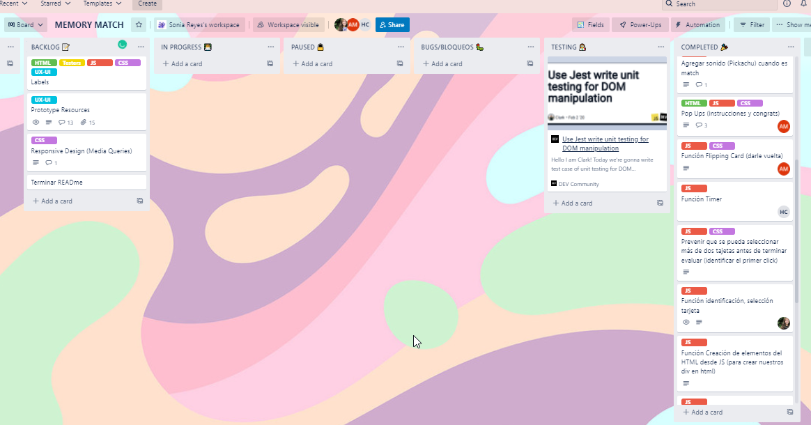
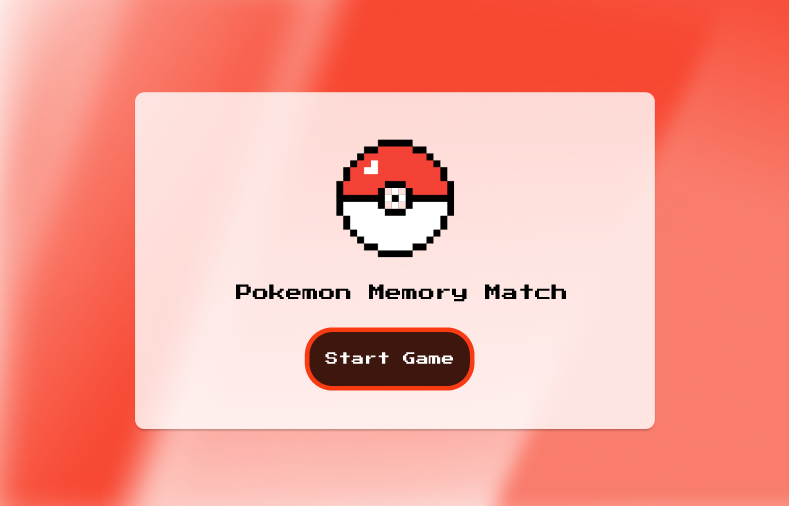
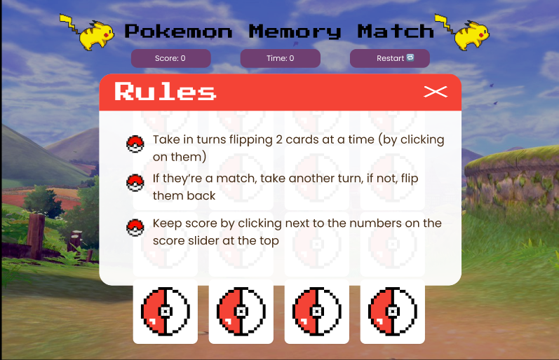
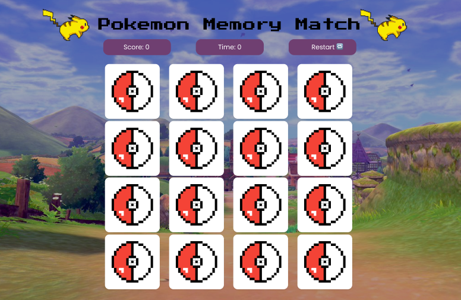
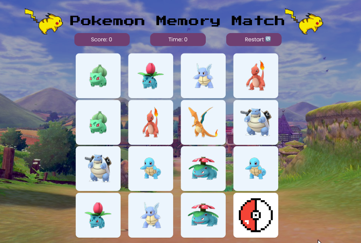
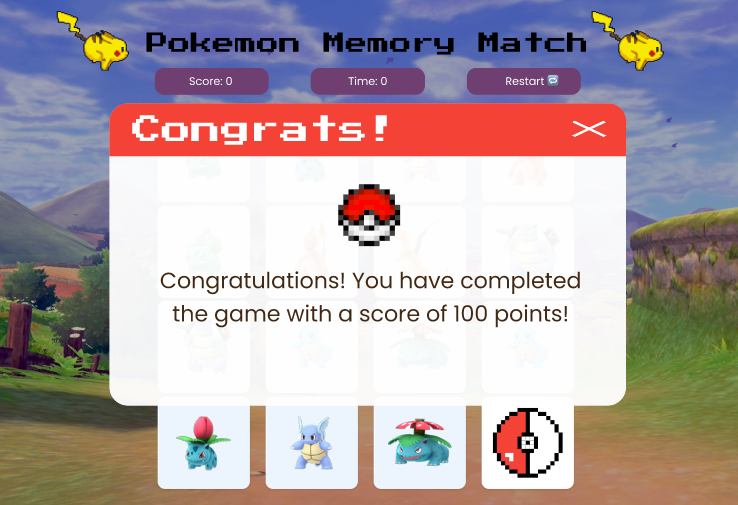
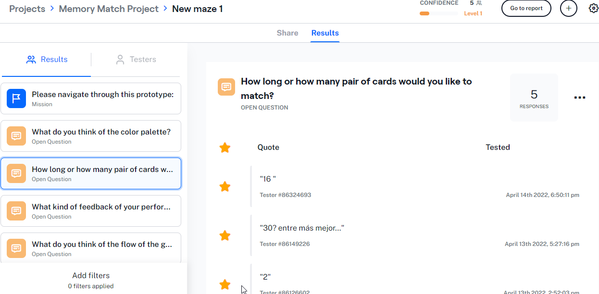

# Pokemon Memory Game 

## Juégalo:
https://soniarez.github.io/SCL020-memory-match/ 

### ¿De qué trata este programa?
Pokemon Memory Game es un juego de memory match, que consiste en descubir pares de tarjetas, es decir, el usuario va seleccionando pares de tarjetas aleatoriamente, y gana puntos al hacer match (coincidir dos tarjetas iguales).

### Definición Usuario:
<b>Rango de edades:</b> Jovenes adultos de 18 - 40 años que quieren jugar, distraerse y ejercitar su memoria y que tengan afinidad por Pokemon, y manejo básico de inglés, ya que el juego está mayormente en dicho idioma. 

### Historia de Usuario:
<b>1-</b> El usuario quiere una interfaz colorida y alegre.
<b>2-</b> Instrucciones claras de lo que debe hacer al jugar.
<b>3-</b> Quiere un set de tarjetas presentadas alatoriamente para empezar a jugar.
<b>4-</b> El usuario quiere saber de alguna manera como va avanzando en el juego, si va encontrando las parejas o no.
<b>5-</b> Quiere saber cuanto tiempo duro y el puntaje acumulado.
<b>6-</b> Al ganar el juego quiere tener otra oportunidad para jugarlo.

### Criterios de Aceptación:
<b>1-</b> Buscar una paleta de colores acorde a Pokemon para que la pantalla de inicio sea visualmente atractiva.
<b>2-</b> Crearemos un Pop up que presente las instrucciones de juego al usuario.
<b>3-</b> Aplicaremos funciones y metodos para realizar en shuffle como "Math Random".
<b>4-</b> Las cartas seran reveladas a medida que se les de "Clic", no puede seleccionar mas de un par en una interaccion. Si su seleccion hace mach se le entregara feedback mediante un sonido de aprobación y las cartas permaneceran reveladas. De lo contrario se daran la vuelta dando otra oportunidad para escoger otro par.
<b>5-</b> Se creara una funcion que llevara el Timer y movimientos que se ira actualizando a medida que vas jugando. Tambien habra una funcion de suma que permita ir acumulando el numero de Mach que lleve el jugador.
<b>6-</b> Se realizara un pop up de felicitaciones, donde se mostrara el resultado y le preguntara si quiere jugar de nuevo.

## Definición de Terminado:
-Se realiza refactorización de código para testeo unitario 
-Se aprueba test unitarios en 72% en statements y funciones
-Se aprueba testeo de usabilidad con usuarios del juego
-Se realiza satisfactoriamente deployment del programa en GitHub Pages y también en Vercel.
-Responsive tanto en mobile tanto en Android como en iOS.

### Recorrido del Usuario:

### Planificación:
Trabajamos mediante sprints semanales, coordinando actividades y tareas en Trello. 

### Protipo en baja:
Primero realizamos un prototipo a papel y lápiz sobre cómo visualizábamos la dinámica del juego y el recorrido que haría el usuario entre pantallas y funcionalidades. Posteriormente, realizamos un prototipo en Alta en Figma, el cual se muestra a continuación:

### Prototipo en alta (Figma):
Luego de contar con un protipo en baja, y conociendo las historias de usuario, empezamos a trabajar en nuestro prototipo en Alta, utilizando Figma y plugins que nos permitieran similar de manera realista la dinámica del juego. 

### Feedback y Testeo de Usabilidad de Prototipo:
Para validar nuestro diseño y conocer la experiencia del usuario en esta etapa, levantamos nuestro prototipo de Figma en Maze.io. Esta es una plataforma que permite recibir feedback del prototipo. Acá además de hacer preguntas, también le dimos al usuario la misión de navegar en el prototipo; esto para conocer cómo ell@s interactuaban en la app.

#### Preguntas realizadas:
<b>Mission:</b> Please navigate through this prototype.
<b>Pregunta 1:</b> What do you think of the color palette?
<b>Pregunta 2:</b> How long, or how many pairs of cards you would like to match?
<b>Pregunta 3:</b> What kind of feedback of your performace you would like to receive through the game. (for example, to be able to see a score, moves done, etc.)
<b>Pregunta 4:</b> What do you think of the flow of the game? (Any feedback you would like to share with us is more than welcome!)

#### Ejemplo de respuestas obtenidas:

A partir del feedback recibido, realizamos mejoras y empezamos a desarrollar el juego en HTML, CSS y Javascript. 